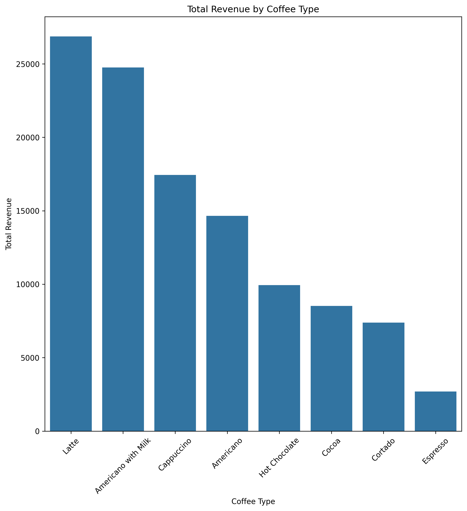
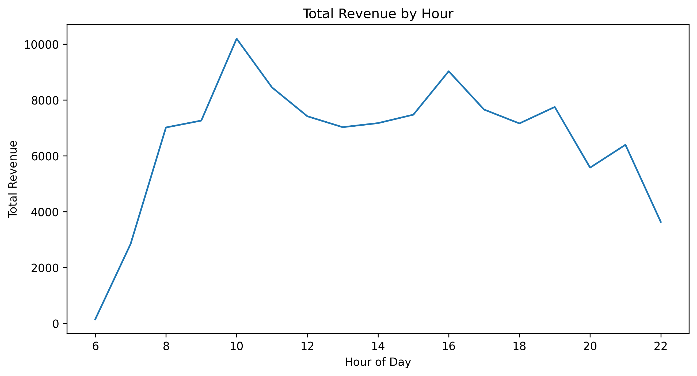
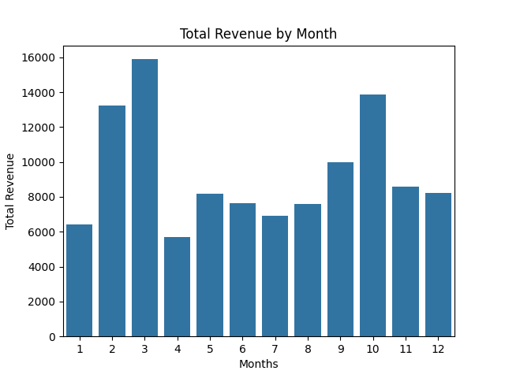

# ☕ Coffee Sales Data Analysis

##  Project Overview

This project analyzes coffee shop sales data to extract meaningful insights about revenue patterns, product performance, and customer behavior.

The workflow includes:

* Data cleaning
* Exploratory Data Analysis (EDA)
* Aggregation
* Data visualization

---

##  Objectives

* Identify the most profitable coffee products
* Analyze revenue across different times of the day
* Detect peak sales hours
* Explore monthly revenue trends
* Understand customer purchasing patterns

---

##  Technologies Used

* **Python**
* **Pandas**
* **Seaborn**
* **Matplotlib**

---

##  Dataset

The dataset contains transaction-level coffee sales data including:

* `hour_of_day` → Hour of purchase
* `money` → Transaction amount
* `coffee_name` → Coffee type
* `Time_of_Day` → Morning / Afternoon / Night
* `Weekday` → Day of the week
* `Monthsort` → Month index
* `Date`, `Time` → Timestamp

---

##  Data Preprocessing

* Removed unnecessary columns (`cash_type`, `Month_name`)
* Converted `Date` to datetime format
* Standardized text fields (`coffee_name`)
* Verified no missing or duplicate data

---

##  Key Insights

*  **Most profitable coffee:** Latte
*  **Least profitable coffee:** Espresso
*  **Most profitable time:** Night
*  **Least profitable time:** Morning
*  **Best sales day:** Tuesday
*  **Lowest sales day:** Sunday

---

## 📈 Visualizations

###  Revenue by Coffee Type

---

###  Revenue by Hour

---

###  Monthly Revenue

---

##  Future Improvements

* Add advanced visualizations (heatmaps, boxplots)
* Build an interactive dashboard (Plotly / Power BI)
* Apply machine learning models for sales forecasting

---

## 👤 Author

**Elif Asya Tanrıvere**
Computer Engineering Student

---

## ⭐ Notes

This project demonstrates a complete beginner-to-intermediate level data analysis workflow using real-world-like data.
